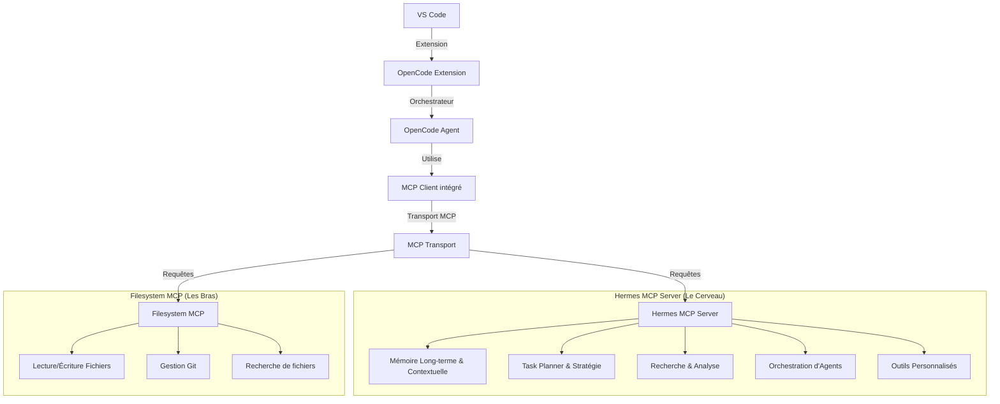

# Architecture MCP : Hermes & OpenCode

Cette architecture repose sur le **Model Context Protocol (MCP)** pour découpler les capacités d'intelligence de la manipulation des données brutes.

## Schéma Conceptuel

## Composants Clés

### 1. OpenCode Agent (L'Utilisateur Final)
- Point d'entrée unique dans VS Code.
- Gère l'interface utilisateur et le flux de travail principal.
- Envoie des requêtes de "planification" ou de "mémoire" au Hermes MCP Server via le client MCP.

### 2. Hermes MCP Server (Le Cerveau)
- **Mémoire** : Stockage des préférences de l'utilisateur, des décisions passées et du contexte de projet.
- **Planning** : Reçoit des intentions complexes et les décompose en tâches atomiques.
- **Agents** : Peut déléguer des sous-tâches à des agents spécialisés (ex: agent de test, agent de refactoring).
- **Outils Personnalisés** : Fonctions spécifiques au projet (ex: génération de docs, analyse de performance).

### 3. Filesystem MCP (La Couche d'Accès)
- Abstraite toute opération de système de fichiers.
- Garantit que le "Cerveau" (Hermes) ne touche jamais directement au disque, mais passe par une interface standardisée.
- Permet à Hermes de demander "Lis le fichier X" ou "Écris ceci dans Y" de manière sécurisée et structurée.

## Flux de Travail Typique
1. **User** : "Refactorise la gestion des utilisateurs dans le backend."
2. **OpenCode** : Reçoit l'intention et demande un plan à **Hermes**.
3. **Hermes** : Consulte la **Mémoire** (conventions du projet) et le **Filesystem MCP** (pour voir le code actuel), puis génère un plan via le **Planning**.
4. **OpenCode** : Reçoit le plan et demande au **Filesystem MCP** d'exécuter les actions d'écriture une par une.
5. **Hermes** : Enregistre le succès et les changements dans la **Mémoire**.
