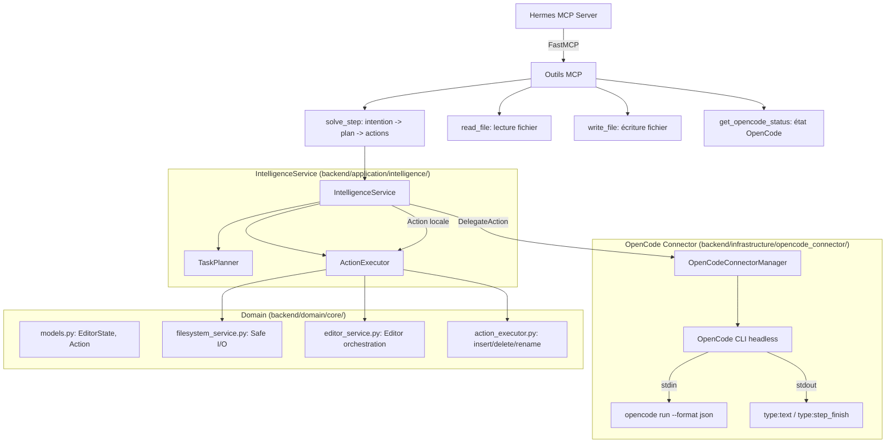

# Architecture MCP : Hermes & OpenCode

Cette architecture repose sur le **Model Context Protocol (MCP)** pour connecter les capacités d'intelligence à l'exécution d'actions sur le code.

## Schéma Conceptuel

## Composants Clés

### 1. Hermes MCP Server (Le Point d'Entrée)
- Service MCP implémenté avec **FastMCP** dans `backend/infrastructure/mcp/server.py`.
- Expose des outils directement appelables : `solve_step`, `read_file`, `write_file`, `get_opencode_status`.
- Point d'entrée unique pour les agents souhaitant déléguer du travail au système Hermes.

### 2. IntelligenceService (Le Cerveau)
- Situé dans `backend/application/intelligence/intelligence_service.py`.
- Reçoit une intention utilisateur et l'état courant (`EditorState`).
- Délègue la planification au **TaskPlanner** qui génère une séquence d'actions.
- Deux modes d'exécution :
  - **Délégation OpenCode** : quand une tâche nécessite un agent externe (`DelegateAction`).
  - **Action locale** : pour les opérations simples de code via `ActionExecutor`.

### 3. OpenCodeConnectorManager (Le Délégataire)
- Interface avec OpenCode en mode **headless** via `backend/infrastructure/opencode_connector/manager.py`.
- Lance `opencode run --format json --port 0 --pure` comme sous-processus.
- Modèle par défaut : `lmstudio/google/gemma-4-12b-qat` (131072 tokens de contexte).
- Communique via stdin/stdout en JSON :
  - `type: "text"` → réponse texte de l'agent.
  - `type: "step_finish"` → étape terminée avec succès.
- Maintient un historique des notifications (`_notification_history`, 100 entrées max).

### 4. ActionExecutor (Les Bras Locaux)
- Gère les actions directes sur le code dans `backend/domain/core/action_executor.py`.
- Actions supportées : `insert_code`, `delete_code`, `rename_file`, `set_cursor`.
- Utilise `FilesystemService` pour les opérations fichier sécurisées (protection directory traversal).

## Flux de Travail Typique

1. **Agent/Utilisateur** : Appelle `solve_step(intent, state)` via MCP.
2. **Hermes MCP Server** : Transmet l'intention à `IntelligenceService.process_user_intent()`.
3. **TaskPlanner** : Analyse l'intention et génère un plan structuré (liste d'actions).
4. **IntelligenceService** : Itère sur les actions du plan :
   - Si `DelegateAction` → appelle `OpenCodeConnectorManager.run()` pour déléguer à OpenCode en mode headless.
   - Si action locale → appelle `ActionExecutor.execute()`.
5. **OpenCode (headless)** : Reçoit le contexte via stdin, exécute la tâche, renvoie le résultat via stdout JSON.
6. **IntelligenceService** : Agrège les résultats et retourne la réponse finale.

## Stack Technique

| Composant | Technologie |
|-----------|------------|
| MCP Framework | FastMCP (Python) |
| LLM (Hermes) | LM Studio / Google Gemma 4 12B |
| LLM (OpenCode) | OpenCode CLI (multi-modèle) |
| Exécution | Sous-processus headless |
| État | EditorState (modèle Pydantic) |
| Fichiers | FilesystemService (sécurité anti-traversal) |
